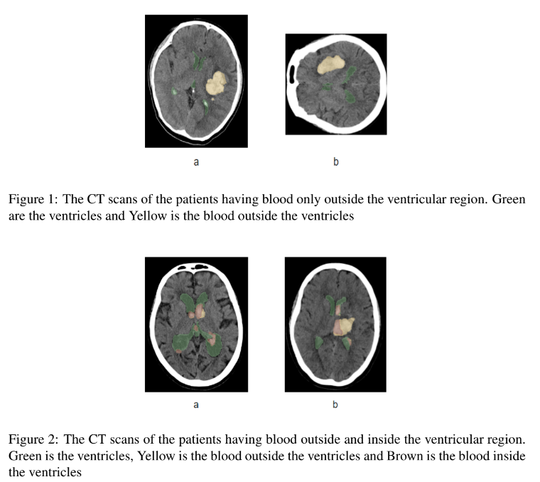
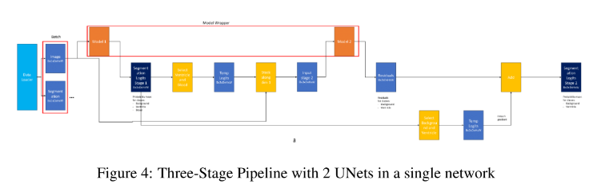
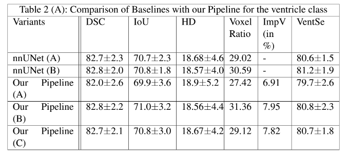
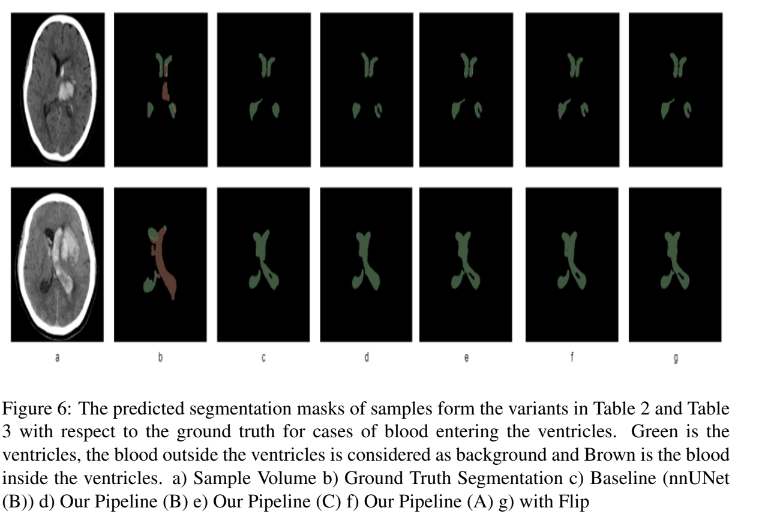

# Brain Ventricle Segmentation With Intra-Ventricular  Hemorrhage
Materials: [Report](https://drive.google.com/file/d/1tsmY6lhaVi6mD5Dk_aai3Q7g-EdwwGnJ/view) | [Slides](https://docs.google.com/presentation/d/1wTPE592huj1HzaRK_G7B1Eh_-nYZWwrl/edit#slide=id.p1) 
 
 
Brain ventricles are one of the prominent structures in the brain, segmenting which can provide in-depth information on multiple brain-related disease 
diagnoses. Unfortunately, the brain ventricle segmentation in complex clinical cases, such as in the coexistence with other lesions/ hemorrhages, or even 
more complex like blood spills due to these lesions/ hemorrhages interfering with the boundaries of the corresponding ventricles remains under-explored.
 

 
In this project, we look at the problem caused by the interference of the blood with the ventricles leading to a decrease in the segmentation performance 
of the UNet model inside the nnUNet framework in detail. To overcome this problem, we propose a novel three-stage pipeline inside the nnUNet framework 
consisting of two UNets and use the robust data preprocessing technique of this framework. 
 

 
We, thereby try to mitigate the effect of blood interference with the ventricles using a robust pipeline inside the nnUNet framework. 
 
Extensive experimental results show that this pipeline archives consistent performance improvements for ventricle segmentation in both 
normal (i.e. without blood interference) and challenging cases (i.e. with blood interference).  
 

 
Thus, this is an end-to-end pipeline built inside a strong and robust baseline framework nnUNet used to alleviate the impact of interference of blood 
inside the ventricles on the segmentation performance leading to slight improvement as seen by the extensive experimentation.
 

 
